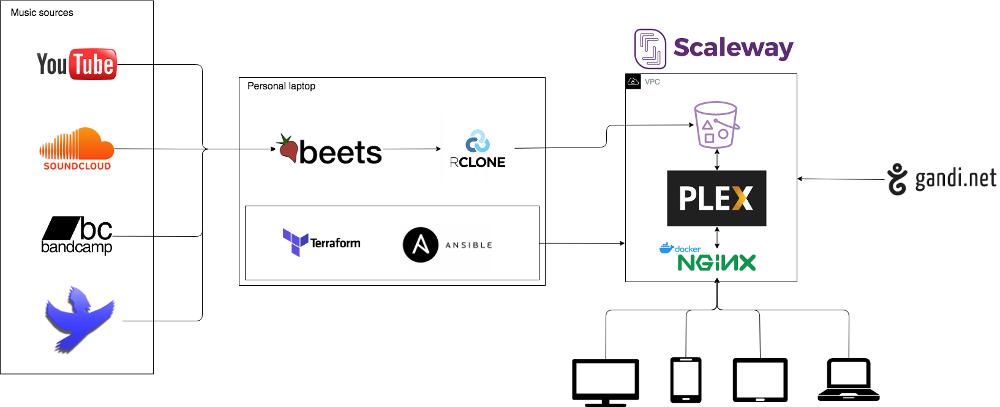

# Media center Infrastructure

## Gandi domain
Media center can be found at https://victor-media-center.xyz. This domain has been registered at Gandi domain registrar.
In the next section, URIs occurence will refer to https://your.media.center.uri

## Ansible
### Install Ansible Galaxy requirements
`ansible-galaxy install -r requirements.yml`

## Scaleway Container Registry (BETA)
### Manual creation
No terraform command available as SCW Container registry is still in beta.
`mediaserverimages` private namespace has been created via GUI.

1. `cd docker_images/nginx && docker build -t nginx-media .`
2. `docker tag nginx-media:latest rg.fr-par.scw.cloud/mediaserverimages/nginx-media:latest`
3. `docker push rg.fr-par.scw.cloud/mediaserverimages/nginx-media:latest`

This image can be pulled from scaleway location later on.

## PLEX
### Configure
In case the plex server is not running on the same local network, one need to setup an ssh tunnel to access the server on `localhost`. It looks like no other URI can be used at first launch probably for security matters.

`ssh -i ~/.ssh/ansible_scw_perso ansible@your.media.center.uri -L 8888:localhost:32400`

## Setup SSL
Once the media server is setup, nginx needs to be installed with certbot in order to get free SSL certificate activated on domain https://your.media.center.uri

### Docker image
I've built a Nginx docker image on my local station then pushed it on SCW Container registry that I had previously prepared. Then it can be used safely on the media server. (See ansible roles/{bootstrap|deploy}-nginx/)

### Certbot
Once the docker container has started, simply enter with `docker exec -it {container.id} bash` command and launch `certbot --nginx -d your.media.center.uri`. You'll be asked a bunch of question that you must answer carefully. Also be aware that these steps might affect your nginx configuration. I'm used to replacing my old configuration with the updated one.